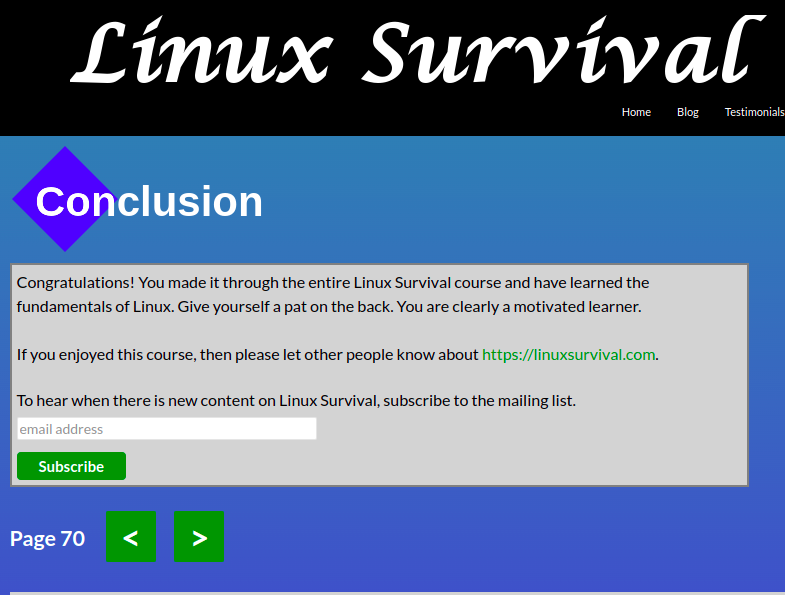

# kottans-frontend

## Git and GitHub
I have studied Git before but now I have learned a lot. It was interesting to learn how to merge branches and handle merge conflicts.

---

## Linux CLI, and HTTP
I use ubuntu and I already know most of the linux commands and try to use them as often as possible.

Articles on HTTP were useful for me. I learned what the request methods are, what the status codes mean, and what tools are used to monitor HTTP traffic and about authentication and hashing!